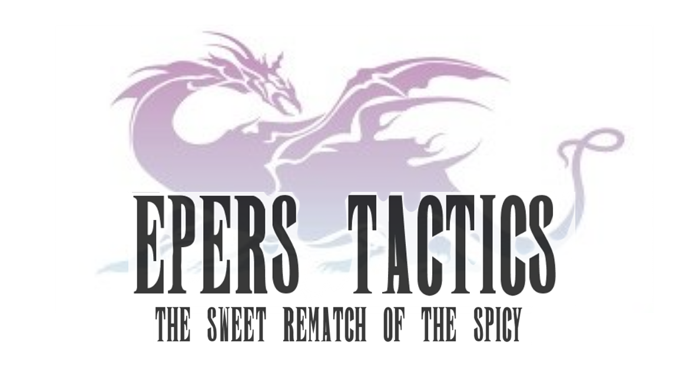

La buena noticia: Empezamos a trabajar para una compañia de videojuegos hace poco.

La mala noticia: La compañia se esta viniendo abajo

Para remontar su pobre situacion financiera, el CEO de la compañia decide invertir todo el resto de los fondos en un juego nuevo como ultima esperanza.

El nombre del juego es

  

Nos asignaron al equipo de backend, encargado de implementar la lógica de negocio que correrá (por ahora) en un datacenter de la empresa. La aplicación también cuenta con un frontend web el cual se encuentra bastante avanzado e interactuará con nuestro backend por medio de una capa de servicios.

## Entregas
- [Entrega 1 - JDBC](enunciado/entrega1/entrega1.md)
- [Entrega 2 - ORM - Hibernate - Hito 1](enunciado/entrega2/entrega2.md)
- [Entrega 2 - ORM - Hibernate - Hito 2](enunciado/entrega2/entrega2.2.md)
- [Entrega 3 - NoSQL - Neo4j](enunciado/entrega3/entrega3.md)
- [Entrega 4 - NoSQL - MongoDB](enunciado/entrega4/entrega4.md)

## Consideraciones
- Se entregará utilizando git. El grupo deberá subir el código del TP a github, hacer un tag y notificarnos de dicho tag para que podamos corregirlo. [Acá](https://sites.google.com/site/estrategiasdepersistencia/material/entregando-con-git) tienen un breve tutorial sobre como hacerlo.
- Se considerará a un TP como entregado solo cuando tenga implementada toda la funcionalidad que se pide para la entrega.
- Se evaluará no solo que el TP cumpla con todos los requisitos, sino la calidad del mismo (buen diseño, simplicidad, buena distribución de responsabilidades, prolijidad del código, código no repetido, formalidad en la entrega, etc)
- La idea del TP es que trabajen sobre todo en clase, pero eso no resta que para llegar a cumplir con los tiempos de entrega tengan que trabajar en casa. ¡Planeen conforme a ello! Un TP no entregado a tiempo es un TP reentregado. **Solo cuentan con 3 reentregas durante la cursada.**
- Si algo no les funciona o algo no entienden, avisen antes! En el día de la entrega ya es demasiado tarde.
