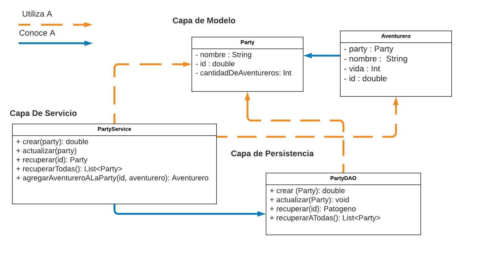

## Entrega 1 - JDBC

El CEO de la empresa en la cual estamos trabajando reúne a toda la fuerza de trabajo y nos comparte el conocimiento necesario para comenzar con la implementación del juego.

Nos cuenta que piensa en crear un juego de combates fantásticos en los cuales se enfrenten dos o varios grupos de aventureros, unos contra los otros. En él, se podrán crear grupos de aventureros a los cuales llamaremos "Party".

  

Como primer prueba de concepto, nos encarga dar los primeros pasos haciendo realidad esta parte inicial del proyecto.

Se nos pide tener un módulo que nos permita administrar los diferentes tipos de Partys y donde puedan registrarse los diferentes aventureros que pertenecen a esas partys. Luego de horas de discusión y planeamiento, el líder técnico llega a nosotros con la siguiente interfaz:

  

***Clase: Party:***

Propiedades: 
- id: long
- nombre: String
- cantidadDeAventureros: int

***Clase: Aventurero:***

Propiedades: 
- id: long
- nombre: String
- Vida: int

La interfaz `PartyDAO` declara los siguientes métodos que nosotros debemos implementar:

- `crear(party: Party ): Long` - Recibe un objeto `Party` y se encarga de persistir en la base de datos. 

- `actualizar(party: Party)` - Actualiza la Party recibida por parámetro.

- `recuperar(idDeLaParty: Long): Party` - Este método devolverá la Party cuyo id sea igual al provisto por parámetro. Se espera que este método devuelva, a lo sumo, un solo resultado.

- `recuperarTodas(): List<Party>` - Este método deberá devolver una lista de todas las partys existentes ordenadas alfabéticamente por su nombre en forma ascendente.

El equipo de front estará utilizando la interfaz  `PartyService` para comunicarse con nuestro equipo. Este servicio deberá implementar métodos que utilizaran al DAO, sumado al siguiente método:

- `agregarAventureroAParty(idDeLaParty: Long, aventurero: Aventurero) : Aventurero` - Deberá lograr que se agregue un nuevo aventurero. Por el momento no nos interesa persistir este aventurero, pero si llevar la cuenta de la cantidad de aventureros que tiene nuestra party.
Nota: Chequear que el aventurero exista antes de incrementar el número de aventureros de la party.

Adicionalmente, el líder del equipo técnico nos adelanta que el equipo de operaciones estarán realizando testeos de la simulación con grandes permutaciones y volúmenes de datos. Nos facilita la siguiente interfaz la cual estarán utilizando para cargar dichos datos en los test, y para la cual deberemos proveer una primera implementación:

La interfaz `DataService` entiende dos mensajes:

- `void deleteAll()` - se espera que tras ejecutarse esto se elimine toda la información persistida en la base de datos, de manera de poder comenzar el siguiente tests desde cero.

- `void crearSetDatosIniciales()` - crea un set de datos iniciales para facilitar las pruebas de frontend.

### Se pide:
- Que provean implementaciones para las interfaces descriptas anteriormente, haciendo uso de todo lo visto en clase.
- Asignen propiamente las responsabilidades a todos los objetos intervinientes, discriminando entre servicios, DAOs y objetos de negocio.
- Creen test unitarios para cada unidad de código entregada que prueben todas las funcionalidades pedidas, con casos favorables y desfavorables. 
- Provean un archivo .sql con las sentencias DDL que sean necesarias para crear el schema de la base de datos (create tables).

### Recuerden que:
- No pueden modificar la interface `PartyService`, solo implementarla.
- Pueden agregar nuevos métodos y atributos a los objetos `Party` y `Aventurero`, pero no eliminar o renombrar atributos / métodos ya provistos.
