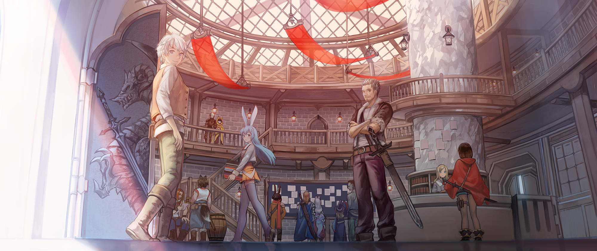

## Entrega 2 - ORM HIBERNATE - Hito 2

La primera demo fue un éxito y todos los testers están encantados con el sistema de juego. 
Algunos de los reviews recibidos fueron:

- "Simple... pero profundo" -  Hideo Kojima

- "Me consiguio novia!" - Francisco Perez Ramos

- "120 de 100" - IGN

Arman una gran celebración por el inmediato éxito con papas fritas, chizitos, gaseosa y sombreros graciosos. 
Todos los desarrolladores e ingenieros atienden y comienzan a despotricarse, pero de pronto, la música se corta y las luces se apagan.
Una singular luz se prende, iluminando al CEO de la empresa, quien con una poderosa voz anuncia:

"Nuestra aventura... sólo acaba de comenzar"

Todos emocionados y con lágrimas en los ojos, lanzan los sombreros y se internan frenéticamente en sus escritorios, listos para continuar el desarrollo de lo que puede llegar a ser... el más grande y significante juego de la historia.

## Funcionalidad

Los testers, si bien contentos, mencionaron que los ayudaría tener acceso a ciertos datos que les permitan mejorar sus estrategias y que sea más fácil ordenar sus parties y aventureros.

Nuestro objetivo para esta próxima iteración es proveer esos datos para que el equipo del front los visualice.

  

### Cambios en PeleaService
- Cuando se inicia una pelea, además de nuestra partyId, se recibirá el nombre de la party contra la que se pelea.
- Cuando se finaliza una pelea, si nuestra party todavía tiene aventureros vivos, marcar la pelea como ganada, caso contrario, como pérdida.
- Cada vez que se resuelve un turno y se genera una nueva habilidad, hay que guardar esa habilidad en la pelea. 
- Cada vez que se recibe una habilidad, hay que guardar esa habilidad en la pelea. 

## Servicios

### AventureroLeaderboardService

- `mejorGuerrero():Aventurero` - Devuelve el aventurero que más daño físico realizó en peleas 
- `mejorMago():Aventurero` - Devuelve el aventurero que más daño mágico realizó en peleas
- `mejorCurandero():Aventurero` - Devuelve el aventurero que más curo en peleas 
- `buda():Aventurero` - Devuelve el aventurero que más meditó en peleas

### PartyService 

- `recuperarOrdenadas(orden:Orden, direccion:Direccion, pagina:Int?):PartyPaginadas` - Devuelve las parties ordenadas en la en la dirección paginadas de a 10.  
Las parties se pueden ordenar por: poder, victorias o derrotas.  
`Poder`: La suma de _daño físico_ + _poder mágico_ + _precisión física_ de todos sus aventureros. 
`Victorias`: La suma de peleas ganadas que tenga la party. 
`Derrotas`: La suma de peleas perdidas que tenga la party.  
La `direccion` puede ser: ascendente o descendente. 
Un ejemplo: `recuperarOrdenadas(PODER, ASCENDENTE, 0)`: Devuelve las primeras 10 parties con más poder. 
La respuesta es un objeto del tipo `PartyPaginadas` que tiene la lista de parties y el total de parties disponibles: 

###  PeleaService

- `recuperarOrdenadas(partyId:Int, pagina:Int?):PeleasPaginadas` - Devuelve las peleas de una party ordenadas de la mas reciente a la mas vieja de forma paginada de a 10. 

### Se pide:

- Que provean implementaciones para las interfaces descriptas anteriormente.
- Asignen propiamente las responsabilidades a todos los objetos intervinientes, discriminando entre servicios, DAOs y objetos de negocio.
- Creen test que prueben todas las funcionalidades pedidas, con casos favorables y desfavorables.

### Recuerden que:

- No pueden modificar las interfaces ya provistas en el TP, solo implementarlas.
- Pueden agregar nuevos métodos y atributos a los objetos ya provistos, pero no eliminar o renombrar atributos / métodos ya provistos.

