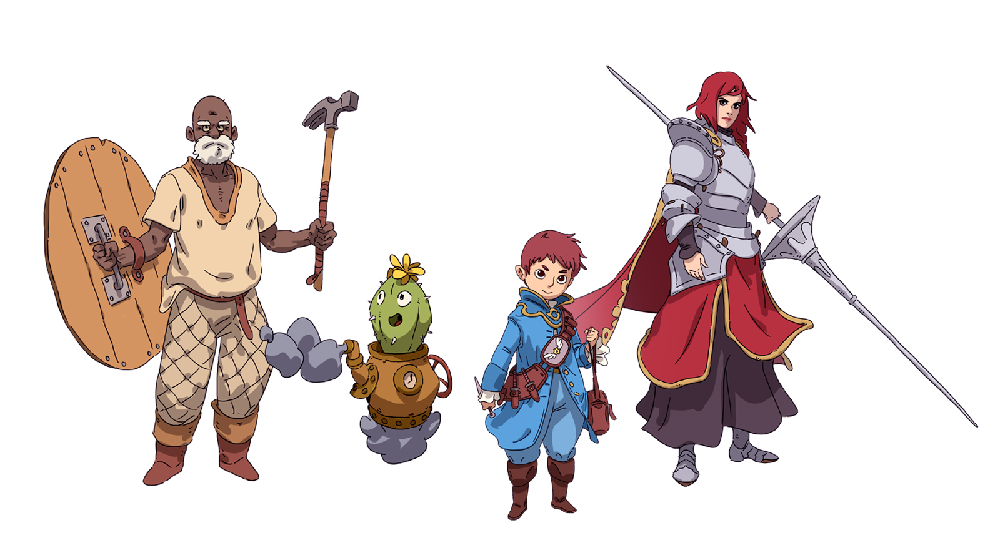
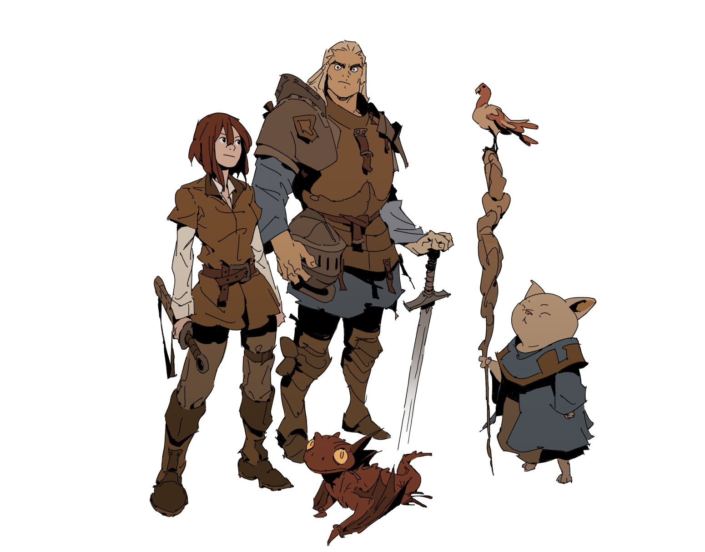
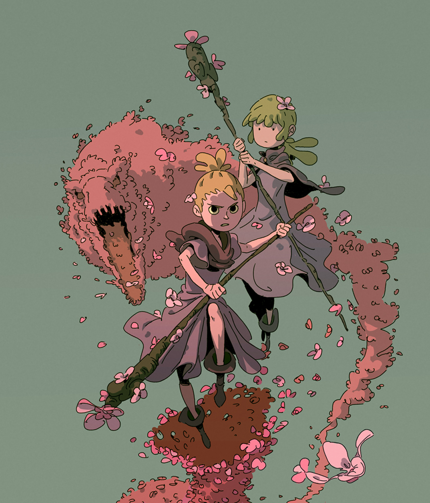
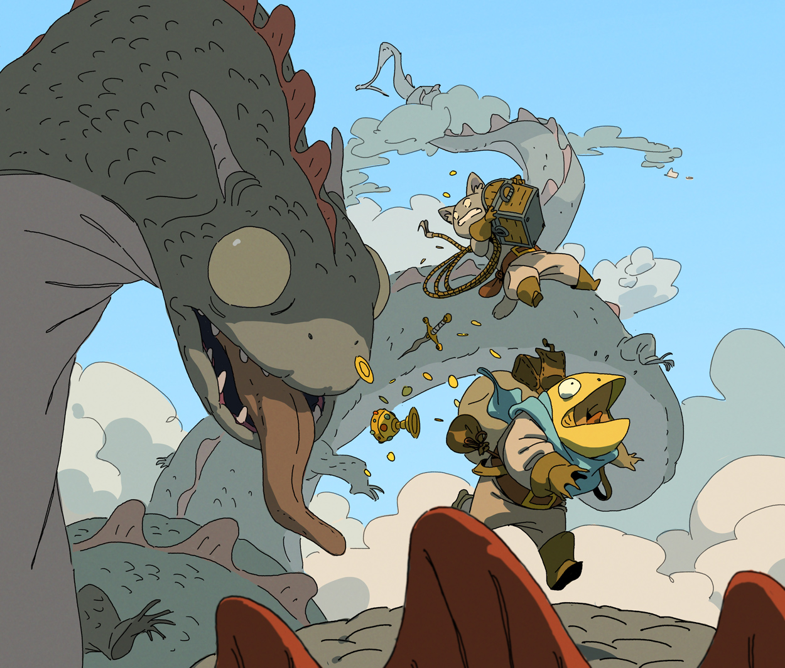

## Entrega 2 - ORM HIBERNATE - Hito 1

## Cambios desde el TP anterior

Se identificaron una serie de cambios necesarios a hacerse sobre la prueba de concepto anterior:  
La capa de persistencia deberá cambiarse para utilizar Hibernate/JPA en lugar de JDBC.  
**Nota:** No es necesario que mantengan los test y funcionalidad utilizando JDBC.

## Funcionalidad

La prueba de concepto fue un éxito! Pero aún es muy temprano para festejar.  
Nos reunimos con el líder del equipo técnico, y nos explica que estamos listos para centrarnos en implementar lo que va a ser la base principal del juego.  
Para ello, nos citan tanto a nosotros como a todo el equipo de desarrolladores a un cómodo cuarto con facturas, café, y un proyector.  
Al llegar, el líder técnico no tarda en comenzar con su presentación, comenzando por contarnos a grandes rasgos de que tratara el juego:

EPERS tactics es un juego de batalla por turnos, en el cual se enfrentaran dos o varios Partys de aventureros, unos contra los otros.  

Cada uno de los aventureros podra poseer atributos, habilidades y características que los distingan entre si, de tal forma que cada aventurero en una party pueda utilizarse para cumplir un determinado rol; ya sea ser un Guerrero con gran defensa que protege a los más débiles, o un brujo con poderosos hechizos que destruya al enemigo.

Las batallas serán resueltas de manera automática por un poderoso servidor de batallas online que está implementando un equipo hermano.  
Lo que es importante para nosotros, es que estas peleas utilizaran los datos provistos por nuestro proyecto.

Para poder realizar estas batallas de forma automática, cada aventurero tendrá sus propias tácticas, las cuales utilizara para determinar como se comportara en batalla.

### Partys

<p align="center">
  
</p>


Una party de aventureros debe poseer:

- Nombre:String
- ImagenUrl:String
- aventureros:List<Aventurero> - Hasta 5 aventureros como máximo

Una Party se crea sin aventureros

### Aventureros

Un aventurero debe poseer:

- Nombre:String
- Nivel: ??
- Atributos: ??
- Estadisticas: ??
- Tacticas: ??
- ImagenUrl:String

#### Nivel

Representa el nivel de experiencia del aventuro en su profesión.  
Todos los aventureros son creados con nivel 1.  
Por ahora no nos vamos a preocupar de como los aventureros aumentan su nivel.

#### Atributos

<p align="center">
  
</p>


Los atributos proporcionan una breve descripción de las características físicas y mentales de cada aventurero:

Estos atributos son:

- **Fuerza**: mide la potencia física y capacidades deportivas.
- **Destreza**: mide la agilidad y los reflejos.
- **Constitución**: mide la resistencia y la salud.
- **Inteligencia**: mide el razonamiento y la memoria.

¿Es un aventurero musculoso y perspicaz? ¿Brillante y encantador? ¿Ágil y robusto? Las puntuaciones  
de atributos definen esas cualidades y muestran en nuestros aventureros sus factores positivos así como  
debilidades.

Las puntaciones de los atributos pueden ir del 1 al 100 como máximo.

#### Estadísticas

Las estadísticas son valores de interés para el funcionamiento de nuestros aventureros.

¿Como nos beneficia a la hora de combatir tener la fuerza de un gigante? ¿Que desventajas puede tener ser lento y torpe?  
Los valores de las estadísticas nos brindan una forma de cuantificar de forma numérica tal respuesta.

Las estadísticas que nos interesan son:

- **Vida**: Representa la cantidad de impacto físico y mágico que puede recibir nuestro aventurero antes de perecer. De estar llena, representa que nuestro aventurero esta en pleno estado físico y mental. Cuando esta repleta, el aventurero ha muerto.

El valor de la vida se calcula con la siguiente formula: `Nivel del aventurero x5 + Constitucion x 2 + Fuerza`

- **Armadura**: Representa la capacidad de resistencia física de nuestro aventurero. De ser alta, será mas dificil para el enemigo causar daño físico en el aventurero.

El valor de la armadura se calcula con la siguiente formula: `Nivel de aventurero + Constitucion`

- **Mana**: Representa la cantidad de energía mágica que un aventurero tiene disponible. Varias habilidades y hechizos requieren la utilización de esta energía para manifestarse de forma material y poder actuar en favor del aventurero.

El mana se calcula con la siguiente formula: `Nivel de aventurero + Inteligencia`

- **Velocidad**: Se utiliza para determinar los reflejos a la hora de esquivar un ataque, y que tan rápido actuara el aventurero en batalla.

La velocidad se calcula con la siguiente formula: `Nivel de aventurero + Destreza`

- **Daño físico**: Utilizado a la hora de determinar cuanto daño es inflingido a un oponente con ataques físicos.

El daño físico se calcula con la siguiente formula: `Nivel del aventurero + Fuerza + Destreza/2`

- **Poder mágico**: Utilizado a la hora de determinar cuanto daño es inflingido a un oponente con ataques mágicos, o cuanta vitalidad recupera un aliado cuando es curado.

El Poder mágico se calcula con la siguiente formula: `Nivel del aventurero + Inteligencia`

- **Precisión física**: Utilizado a la hora de determinar si un ataque da con el enemigo.

La precisión física se calcula con la siguiente formula: `Nivel del aventurero + Fuerza + Destreza`

#### Habilidades

<p align="center">
  
</p>


Las Habilidades representan las interacciones que realizan los aventureros entre si, sean positivas o negativas.

Un Pícaro podrá querer atacar con su daga al mago enemigo, o un clérigo podrá querer curar a un aliado con su magia.

Las habilidades representan entonces acciones que realiza un aventurero (**emisor de la habilidad**) sobre otro (**receptor de la habilidad**).

Nos interesa modelar las siguientes acciones que pueden emitir los aventureros:

- **Atacar**: Se realiza un ataque contra el objetivo. Nos interesa saber sobre el ataque:
  - Daño físico del emisor.
  - Precisión física del emisor.
  - Receptor.

- **Defender**: El aventurero se coloca en acción defensiva, protegiendo a sus aliados del peligro. Nos interesa saber sobre la defensa:
  - El emisor de la acción.
  - Receptor.
  
    Además, cuando un aventurero defiende solo sufre la mitad del daño que recibe hasta su próximo turno.

- **Curar**: Implorando la ayuda de alguna deidad divina, el aventurero cura las heridas de sus aliados. Nos interesa saber sobre la curación:
  - El poder mágico del emisor.
  - Receptor.
  
    Además, cuando un aventurero cura, pierde 5 puntos de mana.

- **Atacar con Magia ofensiva**: El aventurero invoca el poder arcano para dañar a sus enemigos. Nos interesa saber sobre el ataque con magia ofensiva:
  - El poder mágico del emisor.
  - Nivel del emisor.
  - Receptor.
  
    Además, cuando un aventurero ataca con magia, pierde 5 puntos de mana.

- **Meditar**: El aventurero cierra sus ojos y se concentra en absorber el mana de los alrededores. Nos interesa saber sobre meditar:
  - Receptor(en este caso, debe ser siempre el emisor).

También así, nos interesa modelar como se comportan estas habilidades sobre el aventurero receptor:

- **Atacar**: Cuando un aventurero recibe un ataque, debe realizar el siguiente calculo para saber si el ataque fue exitoso:  
  `Ataque Exitoso = (random(1, 20)) + Precisión física del emisor >= Armadura del receptor + velocidad/2`  
  Si el ataque fue exitoso, el receptor recibe daño igual al `Daño físico del emisor`

- **Defender**: Cuando un aventurero es defendido, por los próximos 3 turnos si ha de recibir algún ataque de cualquier tipo, este sera recibido por el defensor.

- **Curar**: Cuando un aventurero es curado, este recupera puntos de vida igual al `poder mágico del emisor`. Los puntos de vida no pueden superar el máximo de vida del aventurero.

- **Atacar con Magia ofensiva**: Cuando un aventurero recibe un ataque, debe realizar el siguiente calculo para saber si el ataque fue exitoso:  
  `Ataque Exitoso = (random(1, 20))+ nivel del emisor >= velocidad/2`  
  Si el ataque fue exitoso, el receptor recibe daño igual al `El poder mágico del emisor`

- **Meditar**: El aventurero recupera mana igual a su nivel.

#### Turnos y Tacticas

¿Es el aventurero es un frágil pícaro el cual se centra en actuar rápido para derribar a magos y clérigos del contrincante antes de que actúen? 
¿Es un guerrero que desea llevar a cabo el mismo fin pero pero priorizando la defensa de sus compañeros cuando estos están débiles?

Las tácticas son la herramienta utilizada por un aventurero para determinar dada la situación de una pelea, que es lo que hará el aventurero cuando llegue su turno de actuar.

Pongamos de vuelta el ejemplo del guerrero para ilustrar a un alto nivel cómo funcionan las tácticas.
El guerrero es fuerte y posee una gran defensa y ataque.
Si sabemos que este aventurero esta en una Party con otros aventureros más frágiles, nos interesaria que pueda protegerlos cuando estos se encuentren bajos de vida. 
Pero también nos interesaria aprovechar su poder de ataque, por lo cual, si ninguno de sus compañeros está dañado, prefeririamos que ataque a un enemigo.

Es esa la necesidad que vienen a solucionar las tácticas: Que **Accion** realizara el **Aventurero** cuando tenga que **resolverTurno()**

#### Estructura y ejemplos de tacticas

Una tactica esta compuesta por los siguientes atributos:
- prioridad: Int
- receptor: ??,
- tipoDeEstadistica: ??
- criterio: ??
- valor: Int
- accion: ??

Sigamos con el ejemplo del guerrero, a mi me gustaría que cuando al guerrero le toque resolver su turno de pelea, elija defender a algún aliado si tiene menos de 20 de vida.
Pero, si ese caso no se da, me gustaría que ataque a un enemigo cualquiera. 

Las tácticas que debería tener el guerrero para indicar este comportamiento serían:

- **prioridad:** 1  - **receptor:** ALIADO  - **tipoDeEstadistica:** VIDA - **criterio:** MENOR_QUE - **valor:** 20 -  **accion**: DEFENDER
- **prioridad:** 2  - **receptor:** ENEMIGO  - **tipoDeEstadistica:** VIDA - **criterio:** MAYOR_QUE - **valor:** 1 -  **accion**: ATAQUE_FISICO


Cuando el guerrero tenga que resolver su turno, entonces primero mirara a la primera prioridad en sus tácticas. Si la condición de esa táctica `Vida < 20` se da para cualquiera de sus aliados, realizará la acción de DEFENDER en su turno para el aliado para el que haya dado verdadera la condición.

Ahora, si ningún aliado tiene menos de 20 de vida, entonces pasará a la táctica de la próxima prioridad.
En este caso, el guerrero buscará a cualquier enemigo vivo de la party contrincante y atacara (acción: ataque físico) a cualquiera que aun tenga vida (ya que la condición es `vida > 1`).

Miremos otro ejemplo, en este caso, el de un mago que busca derribar como prioridad a enemigos con mucha armadura.

Las tácticas para este mago son:

- **prioridad:** 1  - **receptor:** ENEMIGO  - **tipoDeEstadistica:** ARMADURA - **criterio:** MAYOR_QUE - **valor:** 30 -  **accion**: ATAQUE_MAGICO
- **prioridad:** 2  - **receptor:** UNO_MISMO  - **tipoDeEstadistica:** MANA - **criterio:** MENOR_QUE - **valor:** 15 -  **accion**: MEDITAR
- **prioridad:** 3  - **receptor:** ENEMIGO  - **tipoDeEstadistica:** VIDA - **criterio:** MAYOR_QUE - **valor:** 1 -  **accion**: ATAQUE_MAGICO

En este ejemplo, cuando el mago tenga que resolver su turno, mirara a la primera de sus tácticas.
Si cualquier enemigo cumple con la condición `armadura > 30` entonces para resolver su turno, el mago realizará un ataque mágico contra este enemigo.

Si no se da esa condición, entonces el mago evaluará su próxima táctica.
Si el mismo mago tiene  `mana < 15` entonces para resolver su turno, el mago realizara la acción de meditar para recuperar mana. 


**NOTA:** Cabe destacar que el mismo aventurero no cuenta para los objetivos de una táctica cuyo receptor sea "ALIADO".

Como referencia, las posibles opciones que nos enviara el frontEnd para referirse a las tacticas son:
```kotlin
enum class TipoDeReceptor {
    ALIADO,
    ENEMIGO,
    UNO_MISMO
}

enum class TipoDeEstadistica {
    VIDA,
    ARMADURA,
    MANA,
    VELOCIDAD,
    DAÑO_FISICO,
    DAÑO_MAGICO,
    PRECISION_FISICA
}

enum class Criterio {
    IGUAL ,
    MAYOR_QUE ,
    MENOR_QUE ;
}

enum class Accion{
    ATAQUE_FISICO,
    DEFENDER,
    CURAR,
    ATAQUE_MAGICO,
    MEDITAR;
}
```

### Peleas

<p align="center">
  
</p>

Las peleas serán realizadas por un servidor externo que un equipo hermano estará desarrollando.  
Para llevarlas a cabo, el servidor externo utilizara la velocidad de los aventureros para determinar un orden de turnos.  
Luego, en base a la velocidad de los aventureros, el servidor le dará al backend el listado de enemigos y el aventurero que debe actuar.  
El backend debe utilizar las tácticas de ese aventurero para seleccionar una acción a realizar contra que receptor, y en base a eso el servidor de peleas se encargara de hacerle pedir al grupo al cual pertenece el receptor de esa acción que la ejecute.

La pelea continuara hasta que solo un equipo quede vivo.

En nuestro backend nos interesa saber cuando una party esta peleando de tal manera que no se puedan iniciar dos peleas contra esa party al mismo tiempo.
Tambien nos interesa que una vez que se termina una pelea, se recuperen los valores iniciales (mana, vida, estatus, etc) de todos los aventureros de esa party.

## DTO

Una vez terminadas las charlas sobre el juego, el líder técnico cambia de diapositivas y nos comenta sobre grandes avances que estuvo realizando el equipo de Frontend los cuales ya poseen una interfaz semi-funcional lista como prototipo.  
Dado que ellos ya poseen una implementación de ciertos objetos de negocio, nos comenta que se nos va a proveer un DTO (Data Transfer Object) que encapsula la representación de datos que el equipo de frontend están utilizando, y nos pide que una vez implementado este concepto en el backend proveamos la funcionalidad que transforme esa representación en una que se maneje el backend.

Los DTO dados implementaran hasta 3 mensajes que deberemos implementar:

- `aModelo`: Convierte el objeto dado como DTO al objeto de modelo. 

Ejemplo: Dado un AventureroDTO, el metodo "aModelo" debera convertir los datos contenidos en AventureroDTO a un objeto Aventurero valido para nuestro modelo.
- `desdeModelo`: Crea un nuevo DTO basandose en un objeto de modelo.

Ejemplo: Dada una Party, crea una PartyDTO utilizando las caracteristicas de la Party de nuestro modelo para construir su estructura. 
- `actualizarModelo`:  Dado un objeto de nuestro modelo al DTO, el DTO usa los datos en su estructura para actualizar al objeto de modelo.

Ejemplo: Dado un AventureroDTO y un objeto Aventurero, el AventureroDTO usa sus datos para actualizar el objeto Aventurero.

## Servicios

Se pide que implementen los siguientes servicios los cuales serán consumidos por el frontend de la aplicación.

### PartyService

- `crear(party:Party):Party`
- `actualizar(party:Party):Party`
- `recuperar(partyId:Long):Party`
- `recuperarTodas():List<Party>`
- `agregarAventureroAParty(idDeLaParty: Long, aventurero: Aventurero) : Aventurero` 


### AventureroService

- `recuperar(aventureroId:Long):Aventurero`
- `actualizar(aventurero:Aventurero):Aventurero`
- `eliminar(aventureroId:Long)`

### PeleaService

- `iniciarPelea(idParty: Long):Pelea` - La party comienza una pelea. Mientras esta en pelea no puede iniciar otra pelea.
- `estaEnPelea(idParty: Long):Boolean`
- `resolverTurno(idPelea:Long, idAventurero:Long, enemigos: List<Aventurero>) : Habilidad` - Dada la lista de enemigos, el aventurero debe utilizar sus Tacticas para elegir que habilidad utilizar sobre que receptor.
- `recibirHabilidad(idPelea:Long, idAventurero:Long, habilidad: Habilidad):Aventurero` - El aventurero debe resolver la habilidad que esta siendo ejecutada sobre el.
- `terminarPelea(idParty: Long):Pelea`- La party deja de estar peleando y todos los aventureros vuelven a su estado inicial.

### Se pide:

- Que provean implementaciones para las interfaces descriptas anteriormente.
- Que modifiquen el mecanismo de persistencia de Party y Aventurero de forma de que todo el modelo persistente utilice Hibernate.
- Asignen propiamente las responsabilidades a todos los objetos intervinientes, discriminando entre servicios, DAOs y objetos de negocio.
- Provean la implementación de todos los mensajes "TODO" de los DTO
- Creen test que prueben todas las funcionalidades pedidas, con casos favorables y desfavorables.
- Que los tests sean deterministicos. Hay mucha lógica que depende del resultado de un valor aleatorio. Se aconseja no utilizar directamente generadores de valores aleatorios (random) sino introducir una interfaz en el medio para la cual puedan proveer una implementación mock determinística en los tests.

### Recuerden que:

- No pueden modificar las interfaces ya provistas en el TP, solo implementarlas.
- Pueden agregar nuevos métodos y atributos a los objetos ya provistos, pero no eliminar o renombrar atributos / métodos ya provistos.

### Consejos útiles:

- Finalicen los métodos de los services de uno en uno. Que quiere decir esto? Elijan un service, tomen el método más sencillo que vean en ese service, y encárguense de desarrollar la capa de modelo, de servicios y persistencia solo para ese único método. Una vez finalizado (esto también significa testeado), pasen al próximo método y repitan.
- Cuando tengan que persistir con hibernate, analicen:  
  Qué objetos deben ser persistentes y cuáles no?  
  Cuál es la cardinalidad de cada una de las relaciones? Como mapearlas?
