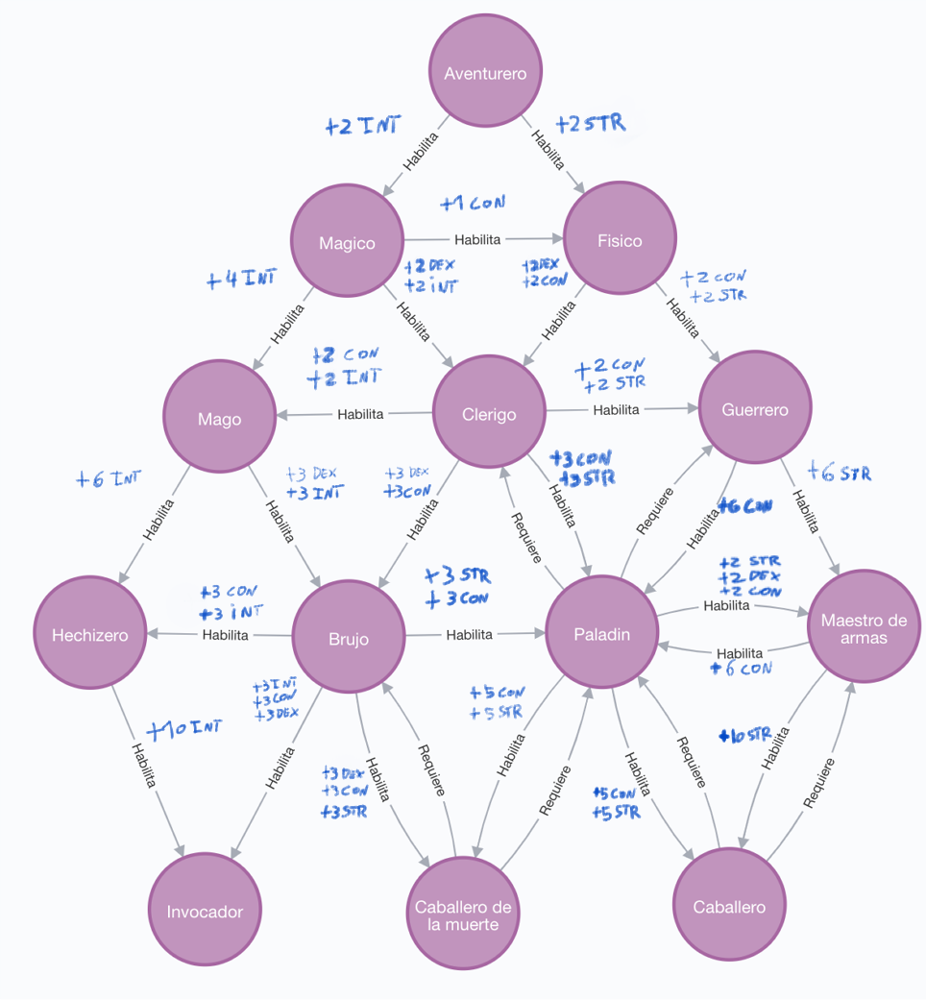
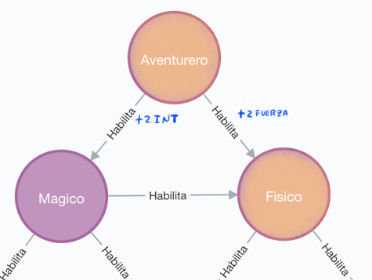

Eran las 4:00Am. Ya se había vuelto casi fortuito para mi el abrir los logs, ojear rápidamente la pantalla buscando alguna suerte de pista, y desistir rápidamente al encontrarme una y otra vez con la misma información que dudosamente ayudaría a resolver el percance que evitaba nuestra salida a producción.

Como se había anunciado, Epers Tactics finalmente se lanzaría a Steam en su versión de Early access.

Pero para sorpresa de todos,  por una mala jugada del destino, la versión lista con el update más importante de todos, el de las clases, había sido esfumada de los repositorios y las máquinas locales.
 Algunos dicen que fue un desarrollador celoso que no quería compartir tal obra maestra con el resto del mundo. Otros dicen que fue otro desarrollador que en su ignorancia puso lógica del DAO en el servicio. Pero de lo que estábamos seguros, es que sin el sistema de clases, la visión que todos compartimos de Eper tactics quedaría incompleta, y destinada al fracaso.

Suspirando, deje mi agotada mirada caer sobre la ventana, observando las estrellas. 

Horas había pasado buscando en los logs alguna pista de como recuperar esa última versión que haría que la aventura finalmente comience.
El silencio de la noche y el cansancio acumulado durante el día corroía poco a poco mi consciencia. Mi mente vagaba libremente y mis pensamientos danzaban frente a mis ojos cegando mi visión y proyectando inusitadas imágenes que se solapan sobre la imagen de la luna, libres de censura alguna. 
Poco a poco… una imagen comenzó a tomar forma… era el CEO de la empresa que con una sonrisa fraternal me alentaba desde el cielo a continuar aun en los tiempos de mayor dolor.

Vi a mis costados a mis compañeros aun en la oficina, que boquiabiertos  y con lágrimas en los ojos observaban a la luna tal como yo lo hacía. Ahí fue cuando lo entendí, la ilusión era colectiva.  Nos miramos todos y entendimos sin comunicar una palabra lo que teníamos que hacer. 

Trajimos desde el repositorio a nuestras máquinas locales la última versión del juego disponible, aquella justo antes de que implementemos el sistema de clases. Y nos pusimos otra vez manos a la obra.

## Entrega 3 - NoSQL - Neo4J

  

Hasta ahora, nuestros aventureros peleaban entre sí inagotablemente sin ver recompensa alguna, destinados a mantenerse en nivel 1 hasta el final de su carrera. Este nuevo Update busca traer un cambio a ese dilema.

### Niveles

Todo aventurero de ahora en más cuando se crea, comenzará siempre en nivel 1, y siendo proficiente solo en la clase “Aventurero”.

Cada vez que una party gana una pelea, todos sus aventureros ganan un punto de experiencia, y un nivel. 

Ese punto de experiencia puede entonces ser usado para ganar proficiencia en otro tipo de clases, como pueden ser guerrero, mago, clérigo, etc.

### Clases

Como ya mencionamos, un aventurero tiene una lista de clases en las cual puede ser proficiente, empezando siempre solo con proficiencia en ser aventurero.

Pero, cada clase (incluyendo aventurero) habilita la opción de ganar proficiencia en otros tipos de clase.

Esa misma habilitación representa una posible ganancia en uno o varios stats para el aventurero, el cual gana una vez adquiere la proficiencia en la nueva clase.

Así mismo, hay ciertas clases que pueden depender que el aventurero tenga proficiencia en otras clases antes de ser desbloqueadas.

Ilustración de cómo puede llegar a verse nuestro grafo de clases:

  

### Mejora

Representa el “camino” que el aventurero decidirá seguir para conseguir, tanto atributos dados por este camino, como la proficiencia de una clase.
Una mejora tiene una clase de inicio, la clase de a mejorar, una lista de atributos y el valor que aumenta de dichos atributos.

### Ejemplo

Midas el aventurero comienza solo con proficiencia en ser aventurero.

  

Pero por su buen desempeño al proteger a sus compañeros, gana una pelea contra un grupo de goblins y sube a nivel 2, ganando así un punto de experiencia.

La clase aventurero, habilita dos opciones diferentes en las que ahora Midas puede volverse proficiente si desea gastar su punto de experiencia en una de ellas.
Una de estas clases es `Fisico`  y la otra es `Mágico`. 

Midas al querer volverse mejor protegiendo a sus aliados con su proeza física, decide gastar su punto de experiencia para ganar proficiencia en ser `Fisico` y así ganar 2 puntos de fuerza 

  

Ahora Midas no sólo es proficiente en ser Aventurero, sino también es proficiente en ser `Fisico`.

Pero nuestra historia no termina ahí, ya que ahora que Midas es `Fisico`, Se habilitan para el nuevas clases en las cuales puede optar ser proficiente si es que gana un nuevo nivel y con ello, un punto de experiencia para invertir: 
Por ser `Fisico`, ahora puede elegir avanzar como `Guerrero` o como `Clérigo`. Aun así, Midas nunca dejó de ser Aventurero, por lo cual, la totalidad de sus opciones cuando tenga que gastar un nuevo punto de experiencia son: `Magico`, `Clérigo` y `Guerrero`.

  

Luego de un nivel, Midas decide hacerse proficiente en la clase `Clérigo`

Pero ahora, él desea ser proficiente en ser un `Paladín`, el inconveniente es que si bien, ser clérigo habilita a `Paladin`, `Paladin` requiere que Midas no sólo sea proficiente como `Clérigo`, sino también como `Guerrero`.

  

## Servicios

Se deberá hacer las siguientes modificaciones a los servicios ya existentes:

- Cada vez que una party sea victoriosa en una pelea, todos sus aventureros deben ganar un punto de experiencia y subir un nivel.

Se deberá implementar un nuevo servicio `ClaseService` que implemente los siguientes métodos

- `crearClase(nombreDeClase:String)` - Crea una nueva clase
- `crearMejora(nombreDeClase:String, nombreDeClase:String, atributos:List<Atributo>, cantidadDeAtributos:Integer)` - Crea la relación de habilitar de una clase a otra, junto con la lista de atributos que un aventurero ganaría y cuánto a cada atributo de ganar proficiencia por este medio. 
- `requerir(nombreDeClase:String, nombreDeClase:String)` - crea la relación de requerimiento de una clase a otra. Esta relación no puede ser bi-direccional.
- `puedeMejorar(aventureroId:long, mejora:Mejora): Bool` - Devuelve true si el aventurero puede realizar la obtención de una nueva proficiencia desde una clase a otra.
- `ganarProficiencia(aventureroId:Long, nombreDeClase: String, nombreDeClase: String): Aventurero` - El aventurero gana la proficiencia desde la clase indicada. Nota: Debe lanzarse una excepción si el aventurero no debería poder ganar
- `posiblesMejoras(aventureroId:Long): Set<Mejora>` - Dado un aventurero, devuelve un set con todas las posibles mejoras.
- `caminoMasRentable(puntosDeExperiencia:Integer, aventureroId: Long, atributo:Atributo ): List<Mejora>` - Devuelve la lista de mejoras en las cuales el aventurero debería invertir para maximizar la ganancia en el atributo dado

### Se pide:
- El objetivo de esta entrega es implementar los requerimientos utilizando una base de datos orientada a grafos.
- Creen test unitarios para cada unidad de código entregada que prueben todas las funcionalidades pedidas, con casos favorables y desfavorables.

### Recuerden que:
- La relación de requerimiento de una clase a otra no son bidireccionales. 
- Encapsulen el acceso a la base de datos detrás de un DAO.

