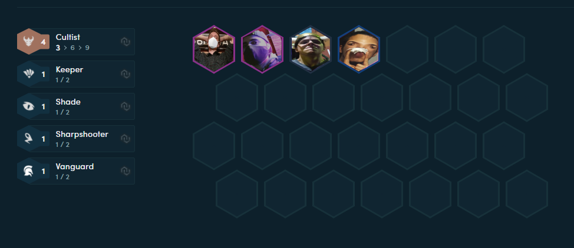

## Entrega 4 - NoSQL - MongoDB

  

Montado al exito del nuevo update de clases, el equipo decidio tomar un descanso luego de la catastrofe que habia sido el primer release en steam, con ojeras y miradas acusadoras, cada uno de los developers decidio irse a su casa para reflexionar sobre lo que habia pasado.

Menos uno, llamemosle I. Dominikow, mmm, muy obvio, mejor Ivan D.

Dormido en frente de su PC se encontraba, colapsado de las horas de crunch que el CEO Ronny habia obligado sobre el, tuvo una epifania presente en ese sueño, tal vez, impulsado por 5 latas seguidas de redbull que tuvo que ingerir, o la aritmia que le causaron las mismas, como una pieza de un rompecabezas que no sabia que estaba haciendo, Ivan D. se levanto de su silla y se paso las proximas 6 hs escribiendo

A primera hora del otro dia, el equipo se encontro con una imagen petrificante

  

El incansable desarrollador perdio toda su noche para crear este documento de texto que tiene en frente suyo, leanlo con cuidado, e ignoren las lagrimas, sudor y sangre que manchan las puntas

## Formaciones

A partir de ahora todas las partys van a cumplir con condiciones para ser parte de una formacion!

¿Que es una formación? Basicamente son ciertos criterios de composicion de una party basados en las clases

Las mismas tiene un nombre, una lista de Requisitos que constan de una clases y la cantidad que tienen que haber de esa clase, 
y una lista de atributos de formacion que dan cuando las condiciones se cumplen

## Atributos de formacion

Ahora, como hacemos para distribuir estos atributos que nos va a dar la formacion?

Simple, ahora las party tienen atributos de formacion, que son los dados por la combinatoria de formaciones existentes para la misma

Estos atributos simplemente se suman a cada uno de los aventureros para que luego se pueda volver a calcular las estadisticas

Los atributos son los mismos que tiene el aventurero: (**Fuerza**, **Destreza**, **Constitución**, **Inteligencia**)

## Ejemplo

Suponte que tengo un team de aventureros

- `Ronny "El Picante"(Aventurero)`
- `Fede "El Audaz"(Aventurero)`
- `Pancho "El Mago"(Mago,Aventurero)`
- `Ivar "El que le pone onda"(Aventurero)`

Y que existe una formacion llamada `Boy Scouts` que consta de tener la combinacion de clases `[Aventurero x 3, Mago x 1]` presente en la party.

A partir de esto, se aplica una mejora a la party para todos los aventureros que consta de `2 Inteligencia`

El flujo de trabajo que definimos anteriormente dicta que los atributos nuevos deben ser cargados a cada uno de los miembros en sus `atributos de formacion` para luego ser aplicados y calculados

Ahora supongamos que Ronny gana una proficiencia nueva que lo hace un `(Aventurero, Guerrero)`, debemos volver a medir todo lo que hicimos antes para ver si se agregan nuevos atributos de formacion

## Servicios

Se deberá implementar un nuevo servicio `FormacionService` que implemente los siguientes métodos

- `crearFormacion(nombreFormacion:String,requerimientos:List<Clases> stats:List<AtributoDeFormacion>):Formacion` - Crea una nueva formación
- `todasLasFormaciones():List<Formacion>`: Devuelve todas las formaciones creadas.
- `atributosQueCorresponden(partyId:Int):List<AtributoDeFormacion>` - Dada una party, devuelve la sumatoria de los atributos de formacion que corresponden
(si mi party cumple con 3 formaciones y esas dan "2 de fuerza", "2 de fuerza y 2 de inteligencia" y "3 de agilidad" se deberia devolver una lista con 4 de fuerza, 2 inteligencia y 3 de agilidad)
- `formacionesQuePosee(partyId:Int): List<Formacion>` - Devuelve la lista de formaciones basado en la composicion de la party

### Se pide:
- El objetivo de esta entrega es implementar los requerimientos utilizando una base de datos orientada a documentos.
- Todas los calulos deben resolverlos con queries de MongoDB
- Creen test unitarios para cada unidad de código entregada que prueben todas las funcionalidades pedidas, con casos favorables y desfavorables.

### Recuerden:
- Encapsulen el acceso a la base de datos detrás de un DAO.
